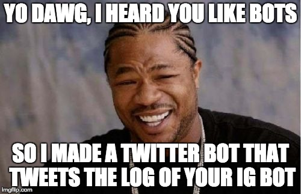

# ig-bot 

## Python3 Instagram grey hat bot (for demonstration purposes only).

This is an instagram bot for demonstration purposes, it does the following:

### Likes and Follows

- select a favourite hashtag
- search for medias with that hashtag
- for each found recent media (unless ~20 people are followed)
	- if the author has less than FOLLOWERS_THRESHOLD followers
		- like its most recents medias (~10)
		- follow that user
- sleep an hour circa

### Image Posting

the bot will post an image on each scheduled time, the description will be the original page title plus the chosen hashtag plus some related hashtag

### Log on Twitter

The bot will tweet whenever it follows an user, sleep after some follows, post an image or when it crash.

# Usage

phase 1:

- choose images to post with the chrome extension, right click on it -> Gram It Later -> select the hashtag

phase 2:

- run python bot/main.py
- check your twitter account or your terminale

# Setup

- hashtags files: you need a file 'hashtags' and 'relatedhashtags' in this directory, containing one hashtag for line.

- put the relative exports in your .profile for instagram credentials, twitter tokens, and the gram it later folder.

- open the movefiles workflows with Automator and set the Chrome's download folder and the gramitlater folder (if you aren't on MacOS, create a script to move gramitlater files after download or set the gramitlater folder as your chrome's download folder).

# Requirements

- python3
- tweepy
- Instagram-API-Python

# Why?

because I love coding and automating things.

# Need Help?

Drop me a line: [@dnlcrl](http://twitter.com/dnlcrl)